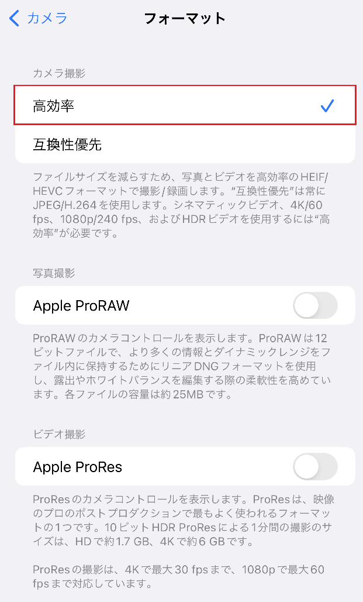
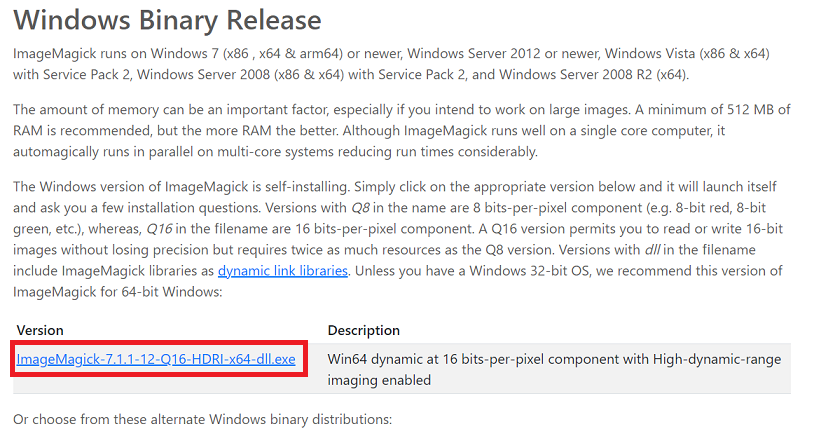
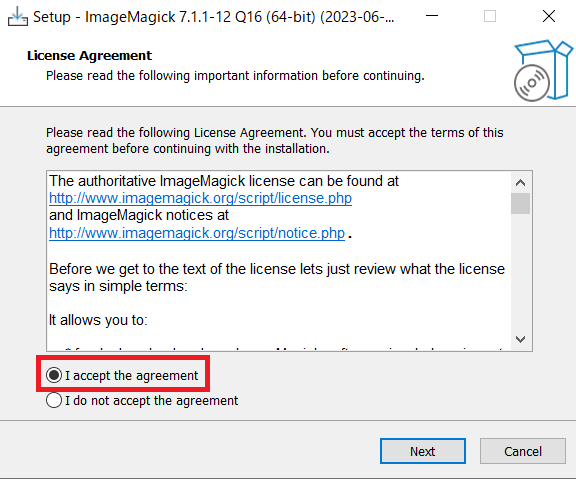
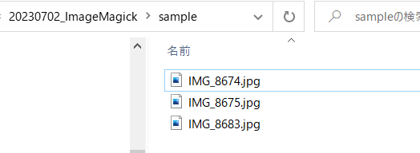
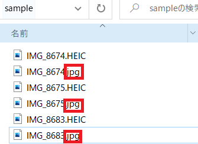

# <span style="color:rgb(213,80,0)">ImageMagickを利用してHEIC形式の画像をjpg形式に変換する</span>
# はじめに

この記事ではHEIC形式で保存された画像をjpg形式に変換する方法についてまとめます。


iPhoneでの画像撮影の`フォーマット`で、`高効率`が選択されている場合、HEIC形式でカメラで撮影した画像が保存されます。

<p style="text-align:left"></p>


HEIC形式で保存されると、ファイルサイズが半分ほどになり、メモリの消費を抑えることができますが、


対応しているアプリをインストールしないと、PCで閲覧ができない、といったデメリットもあります。


少数のファイルであれば、以下のようなオンライン型のプラットフォームにて簡単に変換することができます。


しかし、

   -  大量のファイルを変換したい場合、たくさんアップロードしたりダウンロードしたりする手間が生じる 
   -  サーバーに画像をアップロードすることに不安がある 


といった課題があります。


オンラインでHEICをjpgなどに変換するアプリケーションとしては以下のようなものがあります。


[https://convertio.co/ja/heic-jpg/](https://convertio.co/ja/heic-jpg/)

# 本記事の内容

そこで、本記事では、大量のHEIC形式の画像をまとめてjpg形式に変換します。


環境は以下の通りです。


OS: Windows


プログラミング言語: MATLAB


利用する主なツール: ImageMagick


[https://imagemagick.org/](https://imagemagick.org/)

# 処理内容
## 準備: ImageMagickのインストール

以下のページからImageMagickをインストールしてください。


[https://imagemagick.org/script/download.php#windows](https://imagemagick.org/script/download.php#windows)


私は、以下の赤枠で囲まれているバージョンをダウンロードしました。

<p style="text-align:left"></p>


`I accept the agreement`を選択します。Nextを押すと、インストールを完了することができます。

<p style="text-align:left"></p>


`Program Files`内に以下のフォルダが作成されていることがわかります。もし他の場所にある場合は、次の章のMATLABのコードを一部変更する必要があります。

<p style="text-align:left"></p>

# ImageMagickとMATLABを利用した変換

magick convert というコマンドで、HEIC形式をjpg形式に変換することができます。コマンドプロンプトからでも利用可能ですが、複数のファイルに対して自動的に行うためにMATLABを利用します。


以下のMATLABのコマンドの3行目で、HEICファイルが格納されているパスを指定して下さい。


今回利用したコードやサンプル画像は以下のページにアップロードされています。ぜひお使いください。


https://github.com/KentaItakura/Convert-HEIC-into-jpg-using-ImageMagick


今回の例では、以下のsampleというフォルダにHEIC形式の画像が3つ保存されています。

<p style="text-align:left"></p>

```matlab
clear;clc;close all
% Specify the path where target HEIC images are stored
heicInfo = dir(fullfile(pwd, 'sample\*.HEIC'));
heicName = {heicInfo.name};
heicFolder = {heicInfo.folder};
% Access to magick tool
curPath = pwd;
if exist("C:\Program Files\ImageMagick-7.1.1-Q16-HDRI") == 7
    cd("C:\Program Files\ImageMagick-7.1.1-Q16-HDRI")
else
    cdMagick()
end

% Execute magic convert command 
space = " ";
for i =1:numel(heicInfo)

    magicCommand = strcat('magick convert',space, fullfile(heicFolder{i},heicName{i}),space,fullfile(heicFolder{i},strcat(extractBefore(heicName{i},'.HEIC'),'.jpg')));
    system(magicCommand)
end
```

```TextOutput
ans = 0
ans = 0
ans = 0
```

```matlab
cd(curPath)
```

ImageMagickのバージョンが異なる場合、以下のfunctionにて、インストールされたファイルを検索します。

```matlab
function cdMagick()
    magickInfo = dir('C:\Program Files\ImageMagick*');
    magickName = magickInfo.name;
    magickPath = fullfile("C:\Program Files",magickName);
    cd(magickPath)
end
```

上のコマンドを実行すると、以下の図のように、HEICファイルから変換されたjpgファイルが保存されていることがわかります。

<p style="text-align:left"></p>

# 補足: Pythonを利用した場合

簡単にPythonでも同様の処理を書いてみました。jupyter notebook形式でgithubにアップロードしています。

```matlab
import glob
heicImg = glob.glob(r"D:\blog\2023\20230702_ImageMagick\sample\*.HEIC")
print(heicImg)

print('=====start heic2jpg=====')
for heicName in heicImg:
    # print(heicName)
    input = heicName
    dirname = os.path.dirname(input)
    basename_without_ext = os.path.splitext(os.path.basename(input))[0]
    output = os.path.join(dirname,basename_without_ext+".jpg")
    print('=====')
    print("input: "+input)
    print("output: "+output)
    print('=====Run ImageMagick=====')
    print('Command')
    print(os.path.join(imageMagickPath,"magick convert")+input+ " " + output)
    subprocess.run(os.path.join(imageMagickPath,"magick convert")+input+ " " + output)

print('=====finished=====')
```
# まとめ

この記事では、ImageMagickを利用して、HEIC形式で保存された画像をjpg形式に変換しました。


また、本記事のためのスクリプトはMATLABのライブスクリプトで作成され、以下のコマンドにてマークダウン形式に変換しました。この変換は MATLAB 2023bプレスリリースを利用しています。


`export("README.mlx","README.md","EmbedImage",false)`

